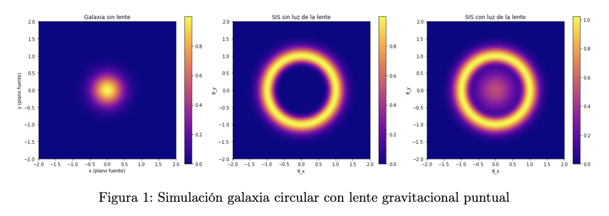
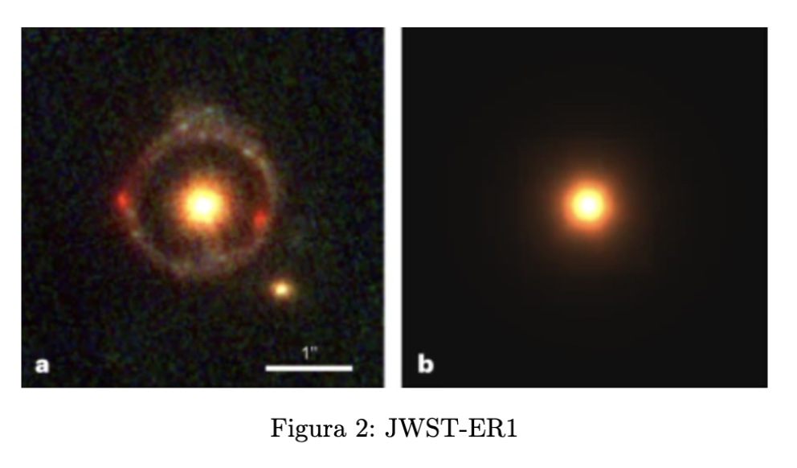
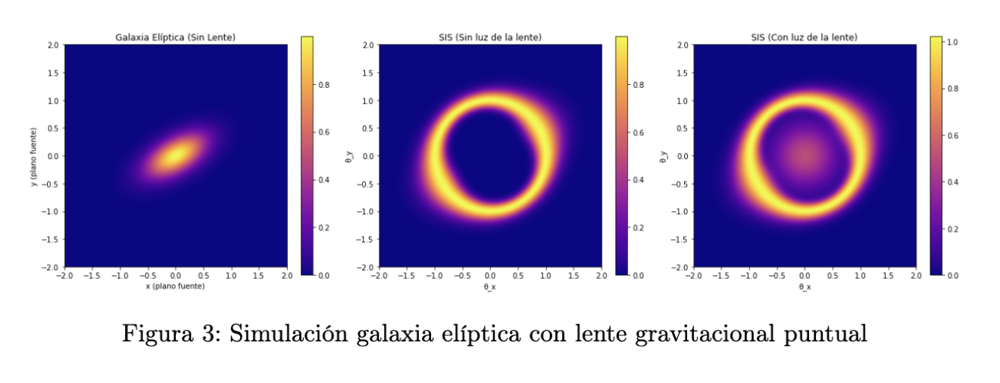
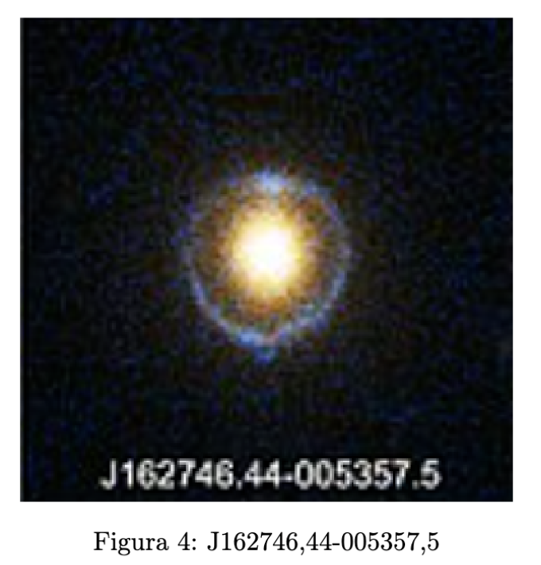
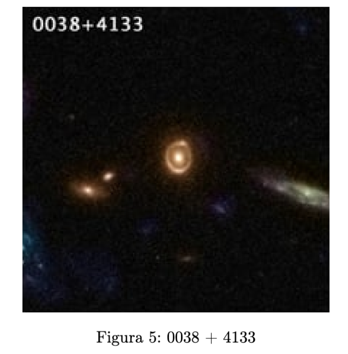
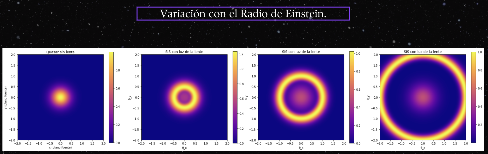
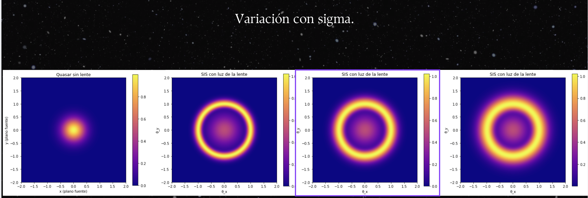
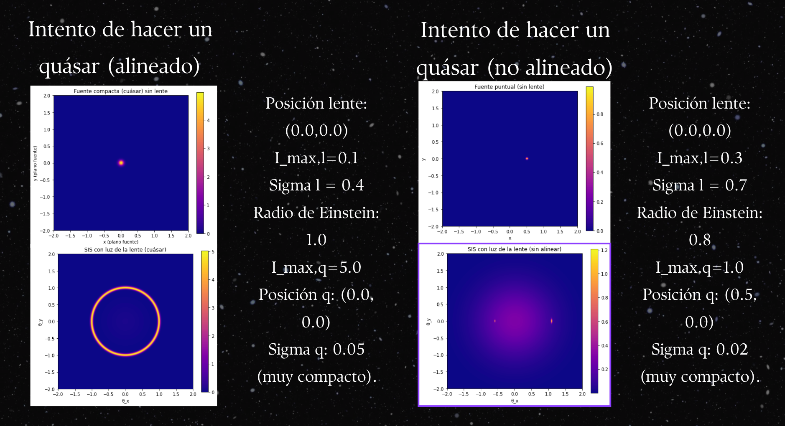
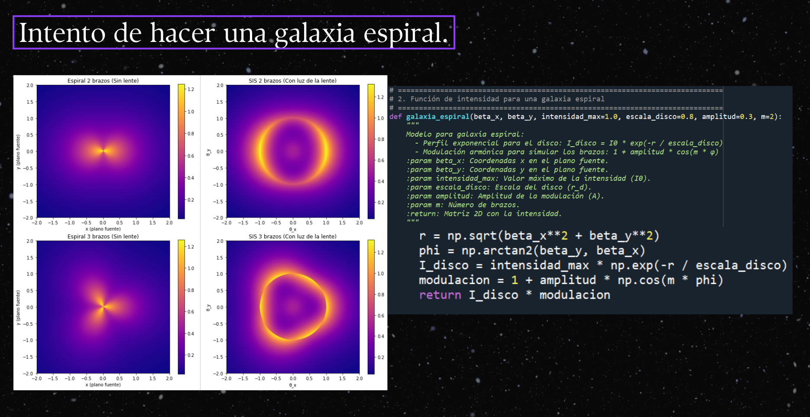

# Results and discussion

## 1. Overview

The results can be grouped into four blocks:

1. **baseline simulations** for circular and elliptical sources,
2. **qualitative comparisons** with real lens observations,
3. **parameter studies** showing how the morphology changes when key parameters are varied,
4. **special cases** such as quasar-like compact sources and a more exploratory spiral-galaxy model.

The main lesson is that even a very simple lensing code reproduces several central features of strong lensing:

- the emergence of a ring under good alignment,
- the sensitivity of the result to the source profile,
- the importance of the Einstein radius,
- the role of the source size in setting ring thickness,
- and the transition from symmetric rings to asymmetric arc/multiple-image structures when alignment is broken.

## 2. Circular source

This figure contains three panels:

1. **left:** the unlensed circular galaxy in the source plane,
2. **centre:** the lensed image without the light of the foreground lens,
3. **right:** the lensed image after adding the foreground-lens light.

### Interpretation

A circular Gaussian source is the cleanest possible starting point. Because the source is intrinsically symmetric and centred on the optical axis, the lens produces an almost ideal **Einstein ring**. The centre panel isolates the geometric lensing effect: the original compact profile is redistributed into a narrow annulus.

When the light of the lens galaxy is added, the image becomes more realistic. The ring is still visible, but it is now superposed on a central brightness component. This mimics the observational situation in which the foreground lens galaxy is not dark and often dominates the central region.

### Why the ring looks the way it does

The ring radius is mainly set by $\theta_E$, while the **ring thickness** reflects the intrinsic width of the source, here controlled by the Gaussian parameter $\sigma$. A compact source creates a relatively thin ring; a broader source creates a thicker, more diffuse structure.

## 3. Real comparison: JWST-ER1

The slide compares a real ring-like observed system with a synthetic centrally concentrated image. Although the code does not perform a quantitative fit to this system, the comparison is still instructive.

### Discussion

- The real image shows a bright central lens and a surrounding ring-like structure.
- The simulation also produces a bright centre plus a ring when the source and lens are nearly aligned.
- The observed ring is more textured and irregular, which is expected: real systems have substructure, noise, finite instrumental resolution, and more complex mass distributions than a toy model.

The comparison demonstrates that the simplified simulation captures the **first-order morphology** of strong circular lensing surprisingly well.

## 4. Elliptical source

Here the source is no longer isotropic. Instead, it is an anisotropic Gaussian with different widths along two axes and a non-zero rotation angle.

### Interpretation

The unlensed source (left panel) is clearly elongated. Once lensed, the ring is no longer perfectly uniform: the brightness varies around the annulus and the symmetry is partially broken. This happens because the lens is mapping a source whose intensity is not distributed equally in all directions.

Adding the light of the lens again increases realism. One sees both the central luminosity of the lens and a distorted ring whose brightness depends on the intrinsic orientation of the source.

### Physical insight

This figure shows an important principle of lensing analysis: the observed image depends not only on the lens but also on the **intrinsic morphology of the source**. Even with a radially symmetric lens, a non-circular source can produce an image whose brightness is direction-dependent.

## 5. Real comparisons for ring-like systems

### J162746.44-005357.5

This observed system exhibits a bright central region surrounded by a faint ring-like or arc-like morphology. The simulation does not attempt a parameter fit, but it does help interpret the qualitative structure: a luminous central foreground object plus a lensed background source can naturally produce this kind of geometry.

### SDSS J0038+4133

This example again shows how real observations often contain a bright central object and a circular or nearly circular surrounding feature. In real data, neighbouring objects, noise, asymmetric mass distributions, and imperfect alignment all complicate the appearance. The simplified code cannot reproduce all that detail, but it does explain why ring-like structures are a natural outcome of strong alignment.

## 6. Parameter study: Einstein radius

This slide shows how the output changes when the **Einstein radius** is varied.

### What changes physically?

The Einstein radius sets the characteristic angular scale of the lens. Increasing it moves the lensed ring outward and increases its radius.

### What is seen in the figure?

- For a **smaller Einstein radius**, the ring is compact and close to the centre.
- For an **intermediate Einstein radius**, the ring grows and separates more clearly from the central light.
- For a **larger Einstein radius**, the ring becomes much wider and reaches the edges of the plotted field.

### Why this matters

This is one of the clearest demonstrations in the repository: the ring size is not arbitrary. It is controlled by a lens-scale parameter, which in real astrophysical systems is tied to the lens mass and to the observer–lens–source geometry.

## 7. Parameter study: source width $\sigma$

This figure explores the effect of changing the Gaussian width $\sigma$ of the source.

### Interpretation

- A **smaller $\sigma$** gives a more compact source. The resulting ring is thinner and more sharply defined.
- A **larger $\sigma$** produces a more extended source. The ring becomes thicker, smoother, and the central region can appear more filled in.

### Physical meaning

The ring does not only encode the lens properties; it also contains information about the **physical size and light profile of the source**. A larger source spreads its emission across a wider range of impact parameters, so the lensed image becomes radially broader.

## 8. Limit case: quasar-like compact source

This is one of the most insightful figures in the whole project because it illustrates the transition from a nearly perfect Einstein-ring case to a broken-symmetry configuration.

### Aligned quasar case

In the left half of the slide, the source is extremely compact and nearly perfectly aligned with the lens. The outcome is a bright, thin, nearly circular ring. This is the limit in which a compact source produces a very clean strong-lensing signature.

### Non-aligned quasar case

In the right half, the source is offset. The ring symmetry disappears, and the image becomes a multiple-image or arc-like configuration instead of a full ring.

### Why this happens

For a compact source, alignment is decisive. When the source lies near the optical axis, the images wrap around the lens and form a ring. When the source is displaced, the degeneracy is broken: some regions are magnified strongly while others are not, and the result is no longer azimuthally symmetric.

This is a very good pedagogical example because it shows, in a direct visual way, **how the Einstein ring emerges as a limit of near-perfect alignment**.

## 9. Spiral-source attempt

The spiral-galaxy figure studies two source profiles: a **two-arm** and a **three-arm** spiral model. Each is then lensed by the same simplified lens.

### What is interesting here?

The intrinsic source morphology leaves an imprint on the lensed brightness distribution. The ring is no longer uniform; instead, different angular sectors become more or less luminous depending on where the spiral arms place the flux.

### Why the result is attractive but tentative

This case is clearly exploratory. It is useful because it shows that one can move beyond simple Gaussian sources and introduce richer structure. However:

- the spiral model is analytic and idealized,
- the mass model is still extremely simple,
- and the project does not include a direct high-quality observational fit for this case.

Therefore, it is best described as a **qualitative attempt** rather than as a validated reconstruction. Still, it is a valuable extension because it shows the student's initiative in pushing the project beyond the most basic source geometries.

## 10. Why these results are meaningful

Even though the project is intentionally simple, it succeeds in illustrating several deep ideas:

1. **Strong lensing is fundamentally geometric.** Alignment and angular scale matter enormously.
2. **The source profile matters.** Circular, elliptical and spiral sources do not lens in exactly the same way.
3. **The foreground lens light matters observationally.** Without it, synthetic images look too clean compared with real observations.
4. **Parameter variation is informative.** Changing $\theta_E$, $\sigma$, or source position immediately changes the morphology.
5. **Simple code can still be physically illuminating.** This is a strong point of the project.

## 11. Limitations and natural next steps

The current repository is best understood as an educational strong-lensing simulator. The main limitations are:

- a very simple radially symmetric lens model,
- idealized source brightness profiles,
- no instrumental PSF convolution or noise model,
- no inverse modelling or parameter fitting against observational data,
- and only qualitative, not quantitative, comparison with real systems.

Natural next steps would include:

- implementing a more standard point-lens or SIS/SIE framework explicitly,
- adding realistic PSF and noise,
- fitting parameters to one observed system,
- introducing off-centre and multi-component sources more systematically,
- and studying magnification maps.

Even without these extensions, the project already works very well as a didactic and visually engaging introduction to gravitational lensing.
